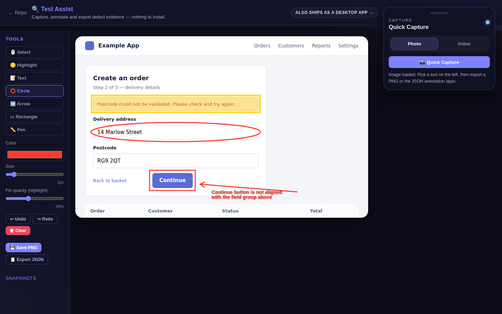
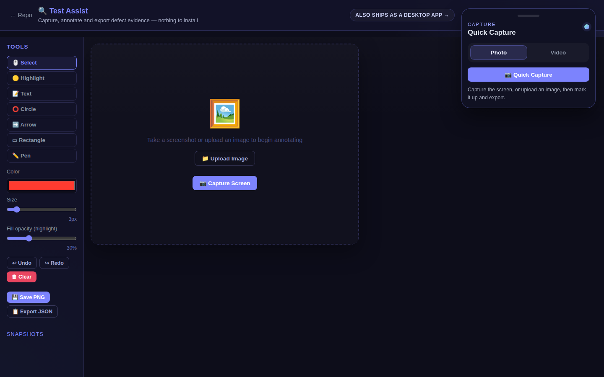
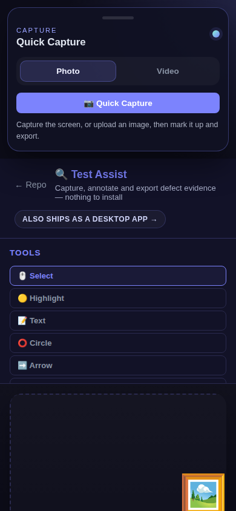

# Test Assist

**A QA engineer's defect-evidence tool.** Capture the screen, annotate what is
wrong clearly enough that a developer needs no further explanation, and export
both a composited image and the annotation data as structured JSON.

It exists because attaching a raw screenshot to a defect is not evidence — it is
a starting point for an argument. A good defect report makes the finding
reproducible from the record alone, and the tooling for that is usually either
heavyweight, cloud-bound, or not built for testers.

Built twice, desktop-first in intent. The PySide6 application is the one designed
to be lived in — a native overlay with a tray launcher that stays above whatever
you are testing. The browser build was written from the same specification so the
tool can be used without an install, which is also what makes it demonstrable
from a link.

Both are real. The browser build runs the whole capture → annotate → export loop
on its own; it is not a preview of the desktop one. What the desktop build adds
is the set of things a browser is not permitted to do.

**Try it in your browser, nothing to install:** https://emil3663.github.io/test-assist/



*A capture being marked up: highlight over the validation error, circle on the
field it refers to, a boxed defect with an arrow, and a typed note. Both exports
are in the left rail.*

<details>
<summary>More screenshots</summary>

**The editor on load**



**Narrow screens** — the launcher and toolbar stack rather than overlapping.



</details>

---

## The two builds

| | Browser | Desktop |
|---|---|---|
| **Stack** | Vanilla JavaScript, Canvas API | Python, PySide6 (Qt) |
| **Install** | None — open the live URL | Download the release zip and run `TestAssist.exe`, or run from source |
| **Capture** | `getDisplayMedia`, `MediaRecorder` | Native screenshot overlay, frame recorder |
| **Best for** | Trying the full capture → annotate → export loop in ten seconds, with nothing to install | Long test sessions — a tray launcher that stays above the application under test |
| **Tests** | 55 Playwright tests — smoke suite in CI, regression suite on demand | 108 pytest tests across a regression and a functional suite, in CI |

Both produce the same two outputs: a composited PNG for attaching to a defect,
and a structured JSON annotation layer.

### Only in the desktop build

The desktop build is the fuller of the two. Some of that is the browser being
sandboxed; some of it is simply where the work went.

- **Crop** and **blur**, the latter for redacting anything sensitive before a
  screenshot goes into a ticket
- Three arrow styles — classic, double-headed and dashed
- **Copy to clipboard**, so evidence goes straight into a ticket without a file
- Zoom, fit-to-window, and a capture history that persists across restarts with
  Today / This Week / This Month filters
- A tray launcher that stays above the application under test, and docks to a
  screen edge as a compact vertical strip
- Single-instance enforcement — a second launch focuses the running window
- Send-to-back layering for overlapping annotations
- MP4 recording via a bundled `ffmpeg` binary — works from source and in the
  packaged build alike

Everything under **What it does** below is the browser build.

---

## What it does

**Capture**

- Screen capture via `getDisplayMedia` (Chrome, Edge, Safari 26+, and Firefox
  through a video-frame fallback, since Firefox has no `ImageCapture`)
- Screen recording via `MediaRecorder` with an mm:ss timer; stop writes a `.webm`
- Image upload by file picker or drag-and-drop onto the canvas

**Annotate**

- Highlight (semi-transparent fill), text comment (multi-line), circle, arrow,
  rectangle, freehand pen
- Colour picker, stroke width 1–20px, highlight fill opacity 0–100%
- Select and drag any annotation to reposition it
- Undo and redo, and clear-all behind a confirmation
- Keyboard shortcuts: `Ctrl+Z`, `Ctrl+Y`, `Ctrl+S`, and `h` `t` `c` `a` `r` `p` `s`
  for the tools
- Touch support, so it works on a tablet

**Export**

- **PNG** — base image and annotation layer composited into one file
- **JSON** — the annotation layer as data, for replay or downstream integration
- Snapshot gallery: every export is kept as a thumbnail you can click to reload

---

## The JSON export

This is the part that distinguishes it from a screenshot tool. Annotations are
exported as data, not baked into pixels, so they can be replayed, diffed,
re-rendered at a different resolution, or consumed by another system.

```json
{
  "annotations": [
    {
      "type": "rect",
      "x": 412, "y": 208, "x2": 690, "y2": 344,
      "color": "#ff3b30",
      "size": 3,
      "fillOpacity": 0
    },
    {
      "type": "text",
      "x": 700, "y": 214,
      "color": "#ff3b30",
      "size": 16,
      "text": "Total ignores the discount applied above"
    }
  ],
  "timestamp": "2026-05-04T09:21:44.301Z"
}
```

`type` is one of `highlight`, `text`, `circle`, `arrow`, `rect` or `pen`. Shape
annotations carry a start and end point; `pen` carries its path; `text` carries
its string. `timestamp` is ISO-8601 at the moment of export.

Because the geometry is preserved, a defect's evidence can be re-rendered against
a later build of the same screen — which is the direction the tool is heading.

---

## Running it

**Browser** — nothing to install; open the live version above, or:

```
Open index.html in Chrome, Edge or Firefox.
```

Screen capture and recording require a secure context, so if you are serving it
rather than opening the file directly, use `localhost` or HTTPS. Declining the
screen-capture permission is handled — you can still upload an image and annotate.

**Desktop — installed** (Windows, no Python needed):

1. Download `TestAssist-<version>-win64.zip` from
   [Releases](https://github.com/emil3663/test-assist/releases)
2. Unzip it anywhere you like
3. Run `TestAssist.exe` — then right-click it and **Pin to taskbar**

The app sits in the system tray with a floating capture launcher. Captures are
kept in `~/.test-assist/history`, recordings in `~/.test-assist/recordings`.

**Desktop — from source**:

```bash
cd python
pip install -r requirements.txt
python main.py          # or: ./run.ps1 on Windows
```

**Desktop — building it yourself**:

```powershell
cd python
.\build.ps1 -Zip -Shortcut
```

That produces `dist/TestAssist/TestAssist.exe`, verifies it actually runs, zips
it, and drops a Desktop shortcut you can pin. The tagged-release workflow runs
the same spec on a clean Windows runner, so a local build and a released build
are produced the same way.

MP4 export uses `imageio-ffmpeg`, a real dependency (`pip install -r
requirements.txt` pulls it in) that bundles a standalone `ffmpeg` binary rather
than linking against opencv — about 29 MB compressed versus the ~250 MB an
opencv/numpy stack would add. It ships in the packaged build too, so MP4
recording works there as well. If encoding ever fails, recordings fall back to
a JPEG frame sequence rather than being lost.

---

## Testing

Both builds carry automated coverage, and both are honest about what is not
covered.

**Browser build — 55 Playwright tests**

```bash
npm ci
npx playwright install chromium
npm run test:smoke        # 8 tests, ~10s — runs in CI on every push
npm run test:regression   # 47 tests, ~55s — on demand
```

The split is deliberate. The smoke suite guards the critical path a reviewer
walks in their first ten seconds. The regression suite covers the rest of
`TEST_PLAN.md` and runs single-worker with **no retries**, so a flaky result
shows up as a flaky result instead of being masked by a rerun. Both start their
own static server on their own port rather than running against `file://` or a
dev server, because `file://` is not a secure context and the capture APIs
behave differently there.

`STABILITY_MATRIX.md` triages every browser test-plan case — 66 automated, 1 blocked —
and records the caveats. The most important one: the native screen-share picker
is browser chrome that no automation can drive, so capture and recording tests
substitute a canvas-backed `MediaStream`. They prove what the app does with a
stream, not that the picker appears.

**Desktop build — 108 pytest tests**

```bash
cd python
pytest -q                 # under 2 seconds
```

`test_regressions.py` holds the original regression cases; `test_functional.py`
covers every feature in `DESKTOP_TEST_PLAN.md` — each tool, crop, blur,
selection and layering, zoom, undo/redo, all three export paths, capture
history, the launcher, shortcuts and the capture overlay. Tests drive real
widgets offscreen rather than asserting on internals where a real path exists.

`DESKTOP_STABILITY_MATRIX.md` triages all 91 cases — 87 automated, 4 blocked —
and says plainly what offscreen testing does not prove: that Qt dispatches
events correctly in a real window, that the layout is usable, or that anything
is legible. Those stay manual.

Executed on every push by `.github/workflows/python-tests.yml`.

---

## Status

Active development. The full annotation and capture feature set is delivered and
in use. Known gaps, all listed in `TEST_PLAN.md`: annotation numbering, PDF
export, cloud save and share, and frame-by-frame video annotation.

---

## How this was built

Specification first. Every ticket carries scope, deliverables, observable
acceptance criteria and explicit dependencies before any implementation begins;
AI coding agents do the implementation; the output is reviewed against that
specification rather than accepted on trust. `TEST_PLAN.md` is the record of what
was verified and what was not.

That method is the point of this portfolio — see
[github.com/emil3663](https://github.com/emil3663).

---

## Licence

MIT. See `LICENSE`.
